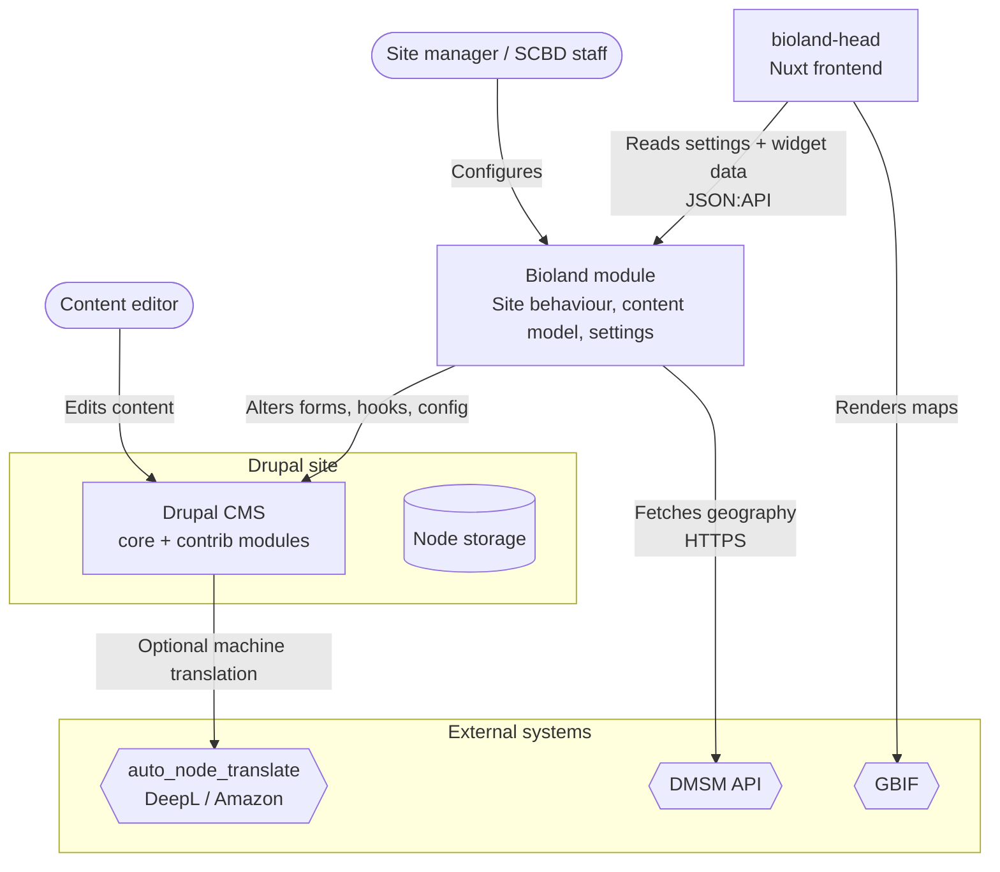
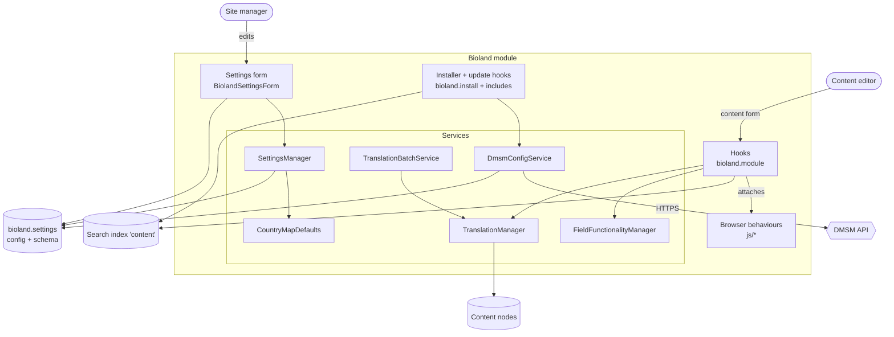
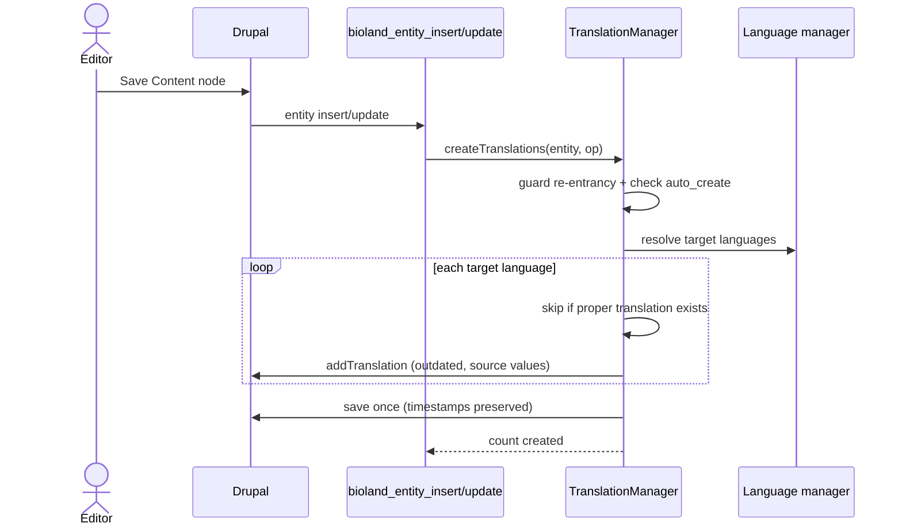
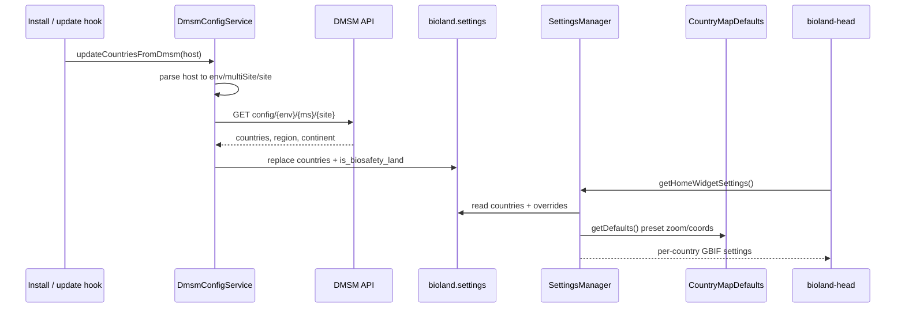
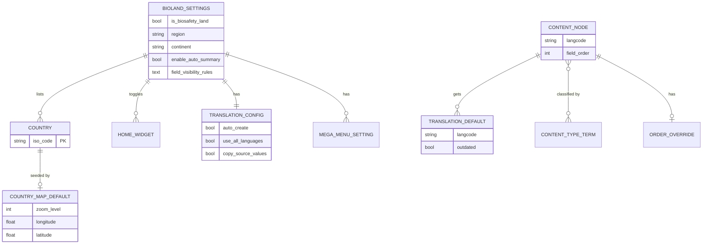
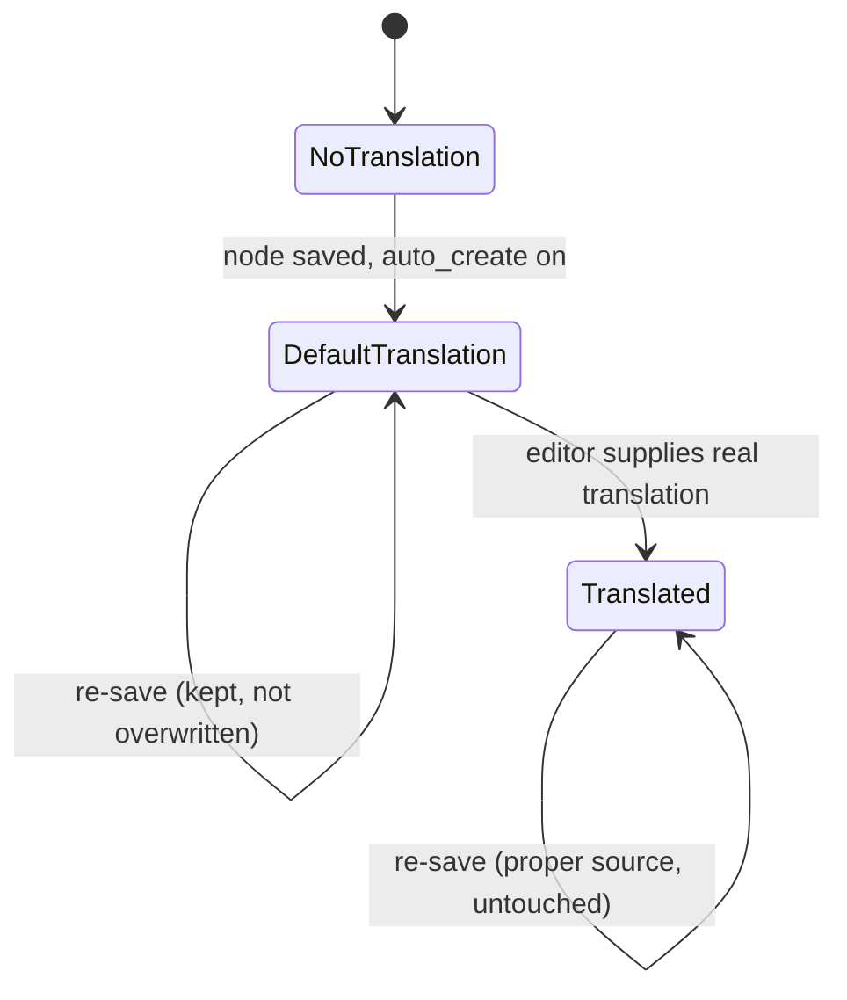

# Bioland Module Architecture

## 1. Overview

Bioland is a Drupal module (machine name `bioland`, package SCBD) that turns a plain Drupal install
into a Bioland or Biosafety Land clearing-house site. It owns one primary content type, a settings
UI with many tabs, a set of editor conveniences delivered as form alters plus browser behaviours,
automatic translation defaults, geographic configuration sourced from the DMSM API, navigation and
search wiring, and a large body of install/update hooks that provision all of the above. The same
module serves both Bioland and Biosafety Land sites; the `is_biosafety_land` flag (and the parsed
multi-site code that sets it) switches branding and which content terms and menus are active.

It does not render the public site. A separate Nuxt front end (the bioland-head frontend) consumes
the settings and home-widget data this module publishes. See `docs/prd.md` for the product framing
and `docs/CONTEXT.md` for the vocabulary used below.

## 2. System Context (C4 L1)

External systems and how Bioland relates to each:

- **DMSM API** is the upstream authority for a site's countries, region, and continent. Bioland is a
  conformist: it parses its own hostname into `env/multiSiteCode/siteCode`, calls
  `https://dmsm.cbddev.xyz/api/config/{env}/{ms}/{site}`, and replaces its local geography with the
  response. It does not own or write back to DMSM.
- **GBIF** is rendered by the front end, not this module. Bioland's contribution is per-country zoom
  and centre coordinates published through home-widget settings.
- **auto_node_translate** (with DeepL and Amazon providers) is a sibling contrib dependency. Bioland
  hides its admin menu items but does not call it; Bioland's own translation feature creates
  placeholder translations, not machine translations.
- **The bioland-head Nuxt frontend** is a downstream consumer. It reads `bioland.settings`
  (mega-menu layout, home-widget toggles, country map data) over JSON:API.

## 3. Containers (C4 L2)

The module is small in PHP class count but wide in surface area. The pieces:

- **`bioland.module`**: the runtime hooks. Form alters on the content form and node form, entity
  insert/update hooks that drive translation defaults, page attachments that publish home-widget
  settings to every page, menu and link alters, and a Search API index alter that injects
  `field_order`.
- **`BiolandSettingsForm`** (about 2900 lines): the multi-tab admin UI. The route's `section`
  parameter selects which tab builds: general, system functions, field visibility, tags, help
  comments, the front-end group and its mega-menu / home-page / home-widgets subsections, and admin.
- **Services**: six classes, all registered in `bioland.services.yml`:
  - `BiolandSettingsManager` reads `bioland.settings` and merges country map defaults for the front
    end.
  - `BiolandFieldFunctionalityManager` builds the `drupalSettings.bioland` payload (feature toggles,
    field-visibility rules, additional-tag content-type maps, translated help comments).
  - `BiolandTranslationManager` creates translation defaults on entity save.
  - `BiolandTranslationBatchService` backfills existing nodes through the Batch API.
  - `BiolandDmsmConfigService` fetches geography from DMSM.
  - `BiolandCountryMapDefaults` holds the static ~240-country zoom/coordinate preset table.
- **Browser behaviours** (`js/*`): Drupal behaviours for field visibility, additional fields, auto
  summary, help comments, home widgets, language redirect, hiding bulk actions, the settings toggle,
  and a shared debug logger. They are attached per feature based on the toggles.
- **Installer and update hooks**: `bioland.install` plus the `includes/bioland.install.*.inc`
  partials, organised by concern (content types, fields, form display, roles, users, menu, search,
  search v2, translation, linkit, editor, jsonapi, views, dmsm, helpers). Schema version is at
  `9061`.

## 4. Key Components (C4 L3)

### Settings form sections

`BiolandSettingsForm::buildForm()` branches on `$section` and builds one tab at a time, with a
matching submit handler per section. The sections map one-to-one to the routes in
`bioland.routing.yml`. General, front-end, system-functions, and admin require `administer bioland
settings` or the administrator role; field-visibility, tags, and help-comments require `administer
bioland field settings`. The form is also where cache rebuild and the translation batch are
triggered (system functions tab).

### Field functionality on the content form

`bioland_form_alter()` only attaches feature libraries on `node_content_form` /
`node_content_edit_form`. `BiolandFieldFunctionalityManager::getJavaScriptSettings()` produces the
`drupalSettings.bioland` payload; each enabled feature adds its library. The same hook also
restructures the form: it moves langcode and `field_order` into the advanced sidebar, wraps the meta
section, and adds a cache-busting query parameter (`seachain-taisce`) on redirect and on admin links.

### Translation defaults

`BiolandTranslationManager::createTranslations()` is the core. It guards against re-entrancy with a
static processing set, honours the `bioland.disable_auto_translations` state flag (set during
install/batch), and only acts when `translation.auto_create` is on and the entity type is enabled.
It never overwrites a translation whose source language is proper (not `und`), marks new
translations outdated, preserves source timestamps, and saves the source entity once.

## 5. Key Flows (sequence diagrams)

### Translation defaults on node save

### Country geography and map defaults

The DMSM fetch runs at install (non-blocking, falls back to defaults) and via `bioland_update_9023`
(blocking: the update fails if DMSM cannot supply countries, to keep stale geography out). The
country list is always a full replace, never a merge. The map-defaults read happens later and on
every page: the saved override wins, then the preset, then a generic fallback.

## 6. Data Model

Almost everything Bioland owns lives in one config object, `bioland.settings`, defined by
`config/schema/bioland.schema.yml` and seeded by `config/install/bioland.settings.yml`. Country map
defaults are code, not config (the static service). Content nodes, their translations, and their
`tags` terms are standard Drupal entities; Bioland only adds `field_order` and the optional
`field_url`, and reads/writes translations and term status. The `COUNTRY_MAP_DEFAULT` is keyed by
the uppercase ISO code and joined to a `COUNTRY` only when that country is configured.

## 7. State

### Translation default lifecycle

A translation default is created outdated and is preserved on every later save as long as its source
language is proper. Once an editor turns it into a real translation it is never reset by this module.

### Site type

`is_biosafety_land` is effectively a two-value site mode (Bioland vs Biosafety Land) derived from the
hostname's multi-site code at install/update. It changes branding (the dynamic settings menu link),
which `tags` terms are enabled, and which menus the content type exposes.

## 8. Deployment / Infrastructure

The module ships inside a Drupal codebase built on the drupal-docker-wrapper base image and is
enabled per site. Notable infrastructure-facing behaviours:

- **System cron is disabled** by `bioland_update_9061` (state key `system.cron_disabled` set true,
  per BL-739, the originating tracker ticket and commit, not an identifier that appears in the code).
  The module sets the flag only; enforcement and any replacement scheduling live
  outside the module. Search API indexing that would normally ride cron must therefore be driven
  externally.
- **Search API** uses the database backend (the `content` index), not Solr. The v2 install path
  (`bioland.install.search.v2.inc`, hooks 9059 and 9060) applies serialized production config and
  rebuilds the index; the older v1 path remains for older installs.
- **DMSM** is reachable over HTTPS at install and update time; the install path degrades gracefully
  if it is not, the update path does not.
- **Environment detection** is by hostname pattern (`cbddev.xyz` dev, `staging.cbd.int` staging,
  `chm-cbd.net` and the biodiv.* hosts prod), which also feeds the DMSM URL.

## 9. Quality Attributes (NFRs)

| Attribute | Target | How the architecture meets it |
|---|---|---|
| Multi-tenancy | One module, two site types, many countries | `is_biosafety_land` + DMSM-sourced geography branch behaviour at runtime; no per-site forks |
| Configuration integrity | No stale geography on prod | DMSM update hook fails the update rather than keeping old countries; country list is replaced, not merged |
| Editor safety | Hard to destroy content or navigation | User-cancel delete/reassign methods removed; main menu locked; menu-parent hidden on translation forms |
| Idempotent provisioning | Re-runnable installs | Work split into numbered update hooks; helpers skip when a dependency module is absent |
| Front-end decoupling | Front end needs no Drupal logic | Settings and per-country widget data published as plain config over JSON:API; map defaults pre-merged server-side |
| Localisation | Content reachable in every enabled language | Translation defaults created on save; `.po` files for ~70 languages; batch backfill for existing content |
| Client resilience | Behaviours never double-bind or crash the form | Data-attribute init guards instead of `once()`; invalid field-visibility JSON fails silently |
| Observability | Translation and DMSM issues are traceable | All activity logged to the `bioland` channel; opt-in browser debug logger gated per feature area |

## 10. Architecture Decisions

Decisions that shape this module are recorded as ADRs in `docs/adr/`:

- `docs/adr/0002-dmsm-authority-for-country-geography.md`: DMSM is the single authority for site
  geography, replacing (not merging) the local list, with a blocking update.
- `docs/adr/0003-translation-defaults-over-machine-translation.md`: Bioland creates placeholder
  translation defaults on save rather than invoking machine translation.
- `docs/adr/0004-disable-system-cron.md`: system cron is disabled in favour of external scheduling
  (BL-739).

See each ADR for the rationale; it is not restated here.

## 11. Risks & Open Questions

- **Cron flag without enforcement.** `bioland_update_9061` sets `system.cron_disabled` but the module
  contains no `hook_cron` guard reading it. Anything that needs the flag honoured (or that needs
  Search API indexing to still run) depends on infrastructure outside this repo. Worth confirming the
  external scheduler exists for every environment.
- **Stale top-level docs.** The root `README.md`, `IMPLEMENTATION_COUNTRY_DEFAULTS.md`, and the
  `docs/COUNTRY_MAP_DEFAULTS.md` reference versioned JS filenames that no longer match (for example
  `-1-0-21`, `-1-0-47` against the current `-1-0-48`) and describe a `/development` debug route that
  does not exist. The `getCountryDefaults()` method they mention is still accurate
  (`src/Service/BiolandCountryMapDefaults.php`), so that reference is fine; it is the versioned
  filenames and the `/development` route that have drifted. Treat the code as truth.
- **Two Search API install paths.** v1 and v2 both exist. A site's correct path depends on its
  history; there is no single switch, so misordered updates could leave an index half-configured.
- **DMSM coupling at update time.** A DMSM outage blocks `drush updb`. That is deliberate, but it
  couples routine deployments to an external service's availability.
- **Large single form.** `BiolandSettingsForm` is one ~2900-line class. It works, but the section
  branching makes it the main place new configuration risks accreting without structure.
